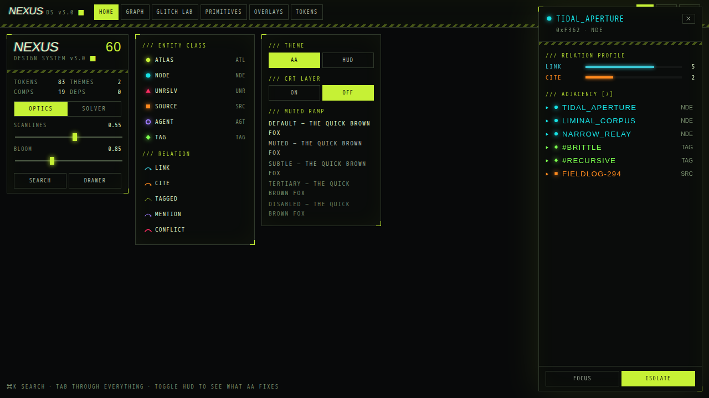

# Nexus Cyberdeck

A HUD design system for React: acid green on near-black, hairline borders,
zero corner radius, corner ticks, monospace everything, and a WCAG AA mode
that is enforced at build time rather than promised in a README. It ships with
a force-directed WebGL graph canvas that speaks the same language.



19 components, two hooks, a search ranker, 83 tokens, two themes. Dark
only and desktop first, built for consoles, dashboards and visualisations
rather than marketing pages. React 18.3 or 19.

## Install

```bash
npm install @nexus-cyberdeck/react @nexus-cyberdeck/tokens
```

```tsx
import "@nexus-cyberdeck/tokens/tokens.css";
import "@nexus-cyberdeck/react/styles.css";
import { NexusProvider, Panel, SectionHeading, Stat, Button } from "@nexus-cyberdeck/react";

export default function App() {
  return (
    <NexusProvider theme="hud-aa">
      <Panel corners={["tl", "br"]} raised style={{ width: 280 }}>
        <SectionHeading>/// subject</SectionHeading>
        <Stat label="Class" value="NODE" tone="info" />
        <Button active>Isolate</Button>
      </Panel>
    </NexusProvider>
  );
}
```

That is the whole install. The [getting-started guide](docs/getting-started.md)
takes it from here to a command palette and a graph in about ten minutes, and
every snippet in it was built from the packed tarballs before it was written
down.

> The packages are not on npm yet. See the guide for installing from
> `npm pack` output in the meantime.

## Packages

| Package                                                | What it is                                                                                                                                      | Gzipped                |
| ------------------------------------------------------ | ----------------------------------------------------------------------------------------------------------------------------------------------- | ---------------------- |
| [`@nexus-cyberdeck/tokens`](packages/tokens/README.md) | CSS custom properties for both themes, typed accessors, contrast ratios computed at build time. Zero dependencies.                              | 3.2 kB css · 0.7 kB js |
| [`@nexus-cyberdeck/react`](packages/react/README.md)   | The 19 components, `useFocusTrap`, `useHotkey`, `rankItems`. Depends only on tokens.                                                            | 6.1 kB js · 5.7 kB css |
| [`@nexus-cyberdeck/graph`](packages/graph/README.md)   | Force-directed WebGL canvas on Three.js: SDF glyph nodes, curved links, CRT post-process. Versioned separately; no dependency on the other two. | 15 kB js               |

Not using React? `@nexus-cyberdeck/tokens` is plain CSS. Set `data-nx-theme`
on any element and the custom properties cascade.

## Why this one

- **The accessible mode is the default, and it is checked by machines.** Each
  theme declares the contrast floors it holds itself to in `tokens.json`, and
  the token build refuses to emit if a colour moves past one. axe-core runs
  over every route, component and overlay state in CI. The `hud` theme is
  required to _fail_ the contrast rule, so the documented trade-off cannot
  quietly become an undocumented one.
- **Category is never colour alone.** Six glyph silhouettes carry meaning
  (WCAG 1.4.1), the criterion most dark-neon systems fail.
- **The blink is capped at 0.94 Hz.** The prototype flickered at 9 Hz, above
  the 3 Hz seizure threshold in WCAG 2.3.1. That is a Level A failure, not a
  taste.
- **A real token architecture.** W3C DTCG source of truth, generated CSS,
  lint rules that stop a component from touching a primitive, and a
  component-token layer you retheme with one custom property on any ancestor.
- **The graph is included.** Most systems stop at the panel. This one ships the
  canvas the panels were designed around.

## Documentation

- [Getting started](docs/getting-started.md): zero to a themed console, verified against a real install.
- [Component reference](packages/react/README.md): every component, the colour props, the accessibility guarantees.
- [Tokens reference](packages/tokens/README.md): every custom property, the typed accessors, DTCG import into Figma or Style Dictionary.
- [Graph reference](packages/graph/README.md): data model, props, controller.
- [STYLING.md](packages/react/STYLING.md): the rule behind the component-token layer and the specificity trap it avoids.
- The showcase (`npm run dev`) renders every component with a rationale note, an accessibility note and a code sample, plus the graph and a shader lab.

## Repository layout

```
nexus/
├── packages/
│   ├── tokens/          @nexus-cyberdeck/tokens   CSS custom properties + typed handles
│   │   ├── build-tokens.mjs             the generator
│   │   ├── lib/wcag.mjs                 contrast maths, dependency-free
│   │   └── src/
│   │       ├── tokens.json              SOURCE OF TRUTH — the only file to edit
│   │       ├── tokens.css               generated · both themes
│   │       ├── contrast.gen.ts          generated · computed ratios
│   │       ├── base.css                 hand-authored base + focus rules
│   │       ├── crt.css                  CSS-only CRT layer
│   │       └── index.ts                 typed accessors
│   ├── react/           @nexus-cyberdeck/react    19 components, no runtime deps
│   │   ├── build-styles.mjs             assembles the shipped stylesheet
│   │   └── src/
│   │       ├── components/<Name>/       one folder per component:
│   │       │                             <Name>.tsx · <Name>.css · <Name>.test.tsx
│   │       ├── hooks/                   useFocusTrap, useHotkey (+ tests)
│   │       ├── search/                  rankItems (+ tests)
│   │       ├── colour.ts                the tone/colour resolver
│   │       └── styles.css               generated · concatenated components
│   └── graph/           @nexus-cyberdeck/graph    force-directed WebGL canvas
├── apps/showcase/       Home · Graph · Glitch Lab · Primitives · Overlays · Tokens
├── browser/             visual regression + axe suite (Playwright, pinned container)
├── docs/                getting-started guide and README assets
├── reference/           preview.jsx — the whole system in one generated file
└── scripts/             build-preview, check-docs, ds-figures, browser-tests
```

## Developing

```bash
npm install
npm run build          # tokens → react → graph with tsup (ESM + CJS + .d.ts), then the preview
npm run dev            # showcase on :5173
npm run typecheck      # tsc, strict
npm run lint           # eslint + stylelint
npm run test           # unit tests, all workspaces
npm run test:browser   # visual regression + a11y (needs Docker)
```

One folder per component, holding everything about it: implementation, its
own CSS where it needs any, and its tests. `styles.css` is generated by
`npm run build:styles`; edit the component's own stylesheet. Components import
each other by path rather than through the barrel, so an import cycle is not
possible, and adding a component means adding a folder. There is no central
list to remember to update.

The figures the showcase advertises (version, token count, component count)
are read from the code at build time by `scripts/ds-figures.mjs`, and
`scripts/check-docs.mjs` fails CI if prose anywhere quotes a stale copy.

## Token architecture

`src/tokens.json` is the source of truth, in W3C DTCG format. `tokens.css` and
`contrast.gen.ts` are generated from it:

```bash
npm run build:tokens     # regenerates both; runs as part of npm run build
```

Editing either generated file by hand is caught in CI. Style Dictionary v4+ and
Figma Tokens Studio can read the token file unchanged.

Three layers. **Components may reference only the semantic layer**, enforced by
ESLint and stylelint rather than by convention.

```
primitive   --nx-acid, --nx-grey-300             raw values, never used directly
semantic    --nx-fg-accent, --nx-border-strong   roles, what components use
component   --nx-btn-border, --nx-panel-padding  per-component, overridable from any ancestor
```

Both themes define every semantic name, so switching themes never touches
component code.

### The one restricted colour

Magenta is reserved for alarm states: unresolved items and conflicts, nothing
else. That restraint is why it reads as a warning rather than decoration.
`--nx-alarm` has exactly one semantic alias, `--nx-fg-critical`. There is no
general accent alias, so it cannot quietly become a button colour.

### Themes

|               | `hud-aa` (default)   | `hud`                    |
| ------------- | -------------------- | ------------------------ |
| muted ramp    | lifted, AA-compliant | the prototype's original |
| type scale    | ×1.15                | ×1.0                     |
| disabled text | 4.52:1               | 2.14:1 ✗                 |
| UI boundaries | 3.01:1               | 1.21:1 ✗                 |

The signature colours are **identical in both**. Acid 14.98:1, data 12.19:1,
lime 15.20:1, sodium 8.32:1, violet 6.27:1, alarm 5.44:1, phosphor 16.84:1.
All already clear AA, which is why the accessible theme needed no redesign.
Only the muted ramp had to move, and it was solved rather than eyeballed: hue
100°, saturation 13%, binary-searched per step against exact contrast targets.

Every ratio quoted above is computed at build time from the resolved token
values, including the comments in `tokens.css` itself. Each theme declares the
floors it holds itself to in `tokens.json`, and the build fails if a colour
moves past one:

```
hud-aa/grey-300 is 4.21:1, below the 4.5:1 floor for disabled text — WCAG 1.4.3.
```

That check is itself tested: `lib/build-tokens.test.mjs` feeds the generator a
deliberately broken palette and asserts it refuses to emit.

## Accessibility

Every claim below is asserted by a machine. `browser/a11y.spec.ts` runs
axe-core over the real rendered page, once per route, once per component and
once per overlay state, plus direct assertions for the things axe cannot see.

```bash
npm run test:a11y
```

axe is treated as a floor, not a ceiling. It found a malformed listbox in
`CommandPalette`'s empty state and a scrollable region with no keyboard access;
it did not notice that the showcase traps focus in a modal drawer at page
load. Automated coverage does not replace using the thing with a keyboard.

Verified behaviours:

- **Focus trap, focus restoration, Escape**: one shared `useFocusTrap`
  implementation used by both Drawer and CommandPalette
- **CommandPalette is a real combobox**: input retains focus and owns
  `aria-activedescendant`, results are a `listbox`, a live region announces
  the result count
- **ToggleRow is a real checkbox**, visually hidden but focusable and announced
- **TabStrip uses roving tabindex** with arrow/Home/End
- **Slider stays a native `<input type="range">`** with `aria-valuetext`
- **Global `:focus-visible`** ring that cannot be removed per component
- **Glyphs carry category by shape**, satisfying 1.4.1
- **Blink capped at 0.94 Hz**, below the 3 Hz threshold in WCAG 2.3.1
- **Slider tracks use `--nx-border-strong`** (3:1) not the decorative hairline,
  because a track is a UI component boundary under 1.4.11
- **`prefers-reduced-motion` collapses every animation**, the blink included,
  and **`prefers-contrast: more` removes the CRT overlay** — both asserted
  against a real renderer
- **The contrast bargain is asserted in both directions**: `hud-aa` passes
  axe's colour-contrast rule and `hud` is required to fail it

## CRT layer

The graph's CRT is a four-pass GPU pipeline: render to texture, bright-pass,
two blurs, then a composite with barrel distortion, chromatic aberration,
aperture grille, rolling refresh bar, grain and glitch slicing. You cannot run
that behind every panel in an application.

`crt.css` gets most of the read for one composited pseudo-element and no
JavaScript. Reserve the shader version for a hero canvas.

```html
<div class="nx-crt nx-crt--roll nx-crt--grain">…</div>
<span class="nx-crt-split">CHROMATIC FRINGING</span>
```

Two switches turn the layer off outright: `data-nx-crt="off"`, an author
decision, and `prefers-contrast: more`, because someone asking for more
contrast should not be fighting a scanline overlay. Under
`prefers-reduced-motion` the rolling refresh bar stops and is removed; the
static scanlines stay, since they are texture rather than motion.

## Claude Design

`@nexus-cyberdeck/react` is wired to a [Claude Design](https://claude.ai/design)
project through `.design-sync/`: `config.json` names the package and the
provider, `previews/` holds one authored preview per component, and
`conventions.md` is the usage guidance uploaded alongside the bundle so
generated screens use real tokens and wrap the tree in `NexusProvider`. The
sync tooling itself is staged into `.ds-sync/` and `ds-bundle/`, both
git-ignored.

## Visual regression

The visual suite covers the things jsdom cannot see: Panel's corner ticks,
focus rings, hover states, both themes, the CRT layer, and the overlays.

```bash
npm run test:visual          # run the suite
npm run test:browser:update  # re-record after an intended visual change
```

**Docker is required, and that is deliberate.** Chromium renders text
differently on macOS and Linux, so a baseline captured on a laptop fails on CI
for reasons unrelated to the change, which is how visual suites end up
permanently red and then permanently ignored. There is one supported renderer:
the official Playwright container, pinned to the same version as the
`@playwright/test` dependency. CI runs the job in that image; the script above
runs the same image locally. Baselines are therefore Linux-only and byte-
comparable everywhere.

The comparison threshold is **zero differing pixels**. If the suite ever goes
flaky the fix is to stabilise the input (wait for a font, disable an
animation, pin a viewport), never to widen the tolerance. An earlier draft of
this config allowed a 0.2% pixel ratio, which sounds conservative and permits
around 360 changed pixels on a panel screenshot; Panel's four corner ticks are
roughly 120 pixels in total, so deleting the entire corner-tick system passed.

## Releasing

Versions and changelogs are managed with [Changesets](https://github.com/changesets/changesets).
Any change a consumer could notice needs one:

```bash
npx changeset      # pick packages, pick the bump, describe the change
```

CI asks for one on any pull request that touches `packages/*/src`. The entry
you write becomes the changelog verbatim, so write it for someone upgrading.

`@nexus-cyberdeck/tokens` and `@nexus-cyberdeck/react` are versioned in
**lockstep**, and `react` depends on an exact `tokens` version rather than a
range. The two communicate through CSS custom property names at runtime: a
component asking for a token a newer build no longer defines does not fail to
compile, it renders the wrong colour. Pinning is what makes that mismatch
unreachable. `@nexus-cyberdeck/graph` versions independently, because it is a
product built _with_ the system rather than part of it.

The packages are still `"private": true`, so nothing publishes yet. Removing
`private` from a package is the only change needed to start publishing it;
the workflow is already wired, and needs the `nexus-cyberdeck` organisation to
exist on npm and an `NPM_TOKEN` secret in the repository.

## What is deliberately not here

A light theme, responsive breakpoints, text inputs, a generic dialog. The
first two are positioning: this is a dark, desktop-first HUD language and it
would be a worse one if it tried to be a general kit. The last two are
gaps, listed below.

## Known gaps

- **No keyboard path to a canvas surface** (WCAG 2.1.1). This belongs in the
  consuming visualisation, not the component layer; provide a list or a
  palette beside the graph.
- **No responsive layout.** The showcase and the Drawer assume a desktop
  viewport. Nothing overflows on a phone, but the drawer covers it.
- **No text input, select or generic dialog.** The palette has an input
  internally; a standalone one is the first post-launch component.
- **No Storybook.** The showcase covers the same ground with rationale notes
  and code samples; a decision on Storybook is pending rather than made.

## License

MIT © Jad Rizk
